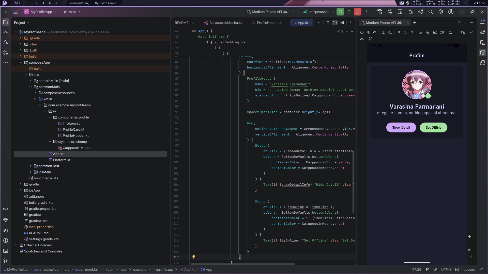
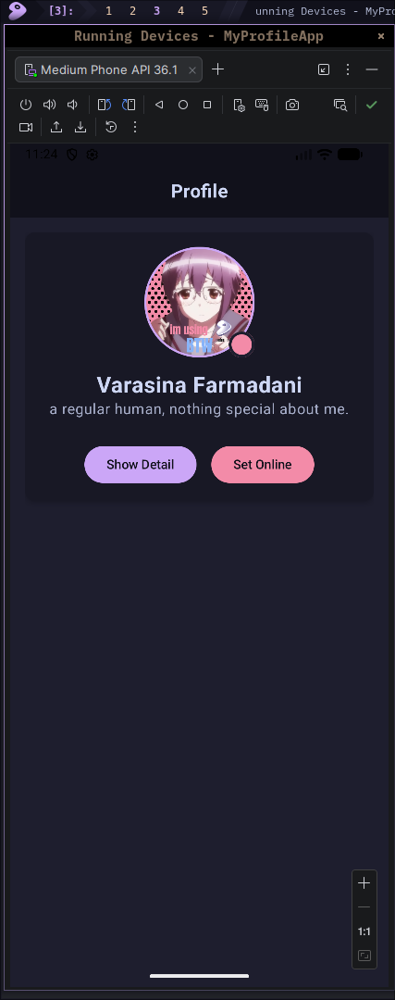
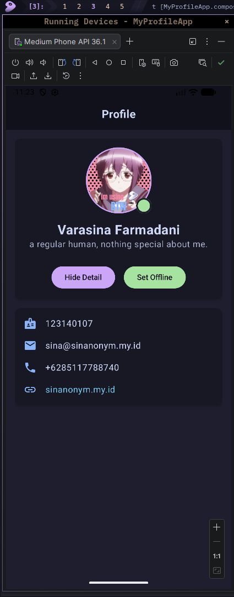

# Tugas 3 PAM - My Profile App

> this app i made to fullfill my homework/task
> see [this module](https://kuliah2.itera.ac.id/pluginfile.php/63173/mod_resource/content/2/Materi_03_Compose_Multiplatform_Basics.pdf) for further details.

---

## Student Identity

Name = Varasina Farmadani

NIM = 123140107

Class = PAM RA

## Screenshoot





## Code Documentation

> its more likely Code Flow

### 1. Custom Theme & Styling

Instead of using the default Material theme colors, I implemented a custom color scheme using the **Catppuccin Mocha** palette to make the UI look more aesthetic and modern. I defined it in an object so it can be accessed globally across the components.
you can see this part in `ui/style/colorscheme/CatppuccinMocha.kt`

```kotlin
object CatppuccinMocha {
    val text = Color(0xFFCDD6F4)
    val subtext0 = Color(0xFFA6ADC8)
    val mauve = Color(0xFFCBA6F7)
    val green = Color(0xFFA6E3A1)
    val red = Color(0xFFF38BA8)
    val mantle = Color(0xFF181825)
    val crust = Color(0xFF11111B)
    val base = Color(0xFF1E1E2E)
    // ... and many more
}

```

### 2. Reusable UI Components

To fulfill the module requirements, I separated the UI into 3 main reusable Composable functions inside `ui/components/profile/`:

1. **`ProfileHeader`**: Handles the circular profile picture, status indicator, name, and bio. It accepts a `statusColor` parameter to dynamically change the online/offline indicator.
2. **`InfoItem`**: A reusable row for contact details. It accepts an `ImageVector` for the icon, a `text` string, and an optional `color` parameter.
3. **`ProfileCard`**: A custom wrapper using Material3 `Card` that acts as a container with predefined elevation, rounded corners, and Catppuccin's `mantle` background color.

Here is how `ProfileCard.kt` is structured using a trailing lambda (`content`):

```kotlin
@Composable
fun ProfileCard(content: @Composable () -> Unit) {
    Card(
        modifier = Modifier.fillMaxWidth(),
        elevation = CardDefaults.cardElevation(defaultElevation = 4.dp),
        shape = RoundedCornerShape(12.dp),
        colors = CardDefaults.cardColors(
            containerColor = CatppuccinMocha.mantle
        )
    ) {
        Column(
            modifier = Modifier.padding(16.dp),
            verticalArrangement = Arrangement.spacedBy(16.dp)
        ) {
            content()
        }
    }
}

```

### 3. State Management & Animation

I used Jetpack Compose's state management (`remember { mutableStateOf(...) }`) to handle user interactions directly in `App.kt`.

* `showDetailInfo`: A boolean state to toggle the visibility of the contact details. I wrapped the contact card with `AnimatedVisibility` for a smooth expand/collapse transition (Bonus point implementation).
* `isOnline`: A boolean state to toggle the profile status. When the "Set Offline/Online" button is clicked, it changes the `statusColor` parameter passed to `ProfileHeader`.

```kotlin
var showDetailInfo by remember { mutableStateOf(false) }
var isOnline by remember { mutableStateOf(true) }

// Passing the state to ProfileHeader
ProfileHeader(
    name = "Varasina Farmadani",
    bio = "a regular human, nothing special about me.",
    statusColor = if (isOnline) CatppuccinMocha.green else CatppuccinMocha.red
)

// Animation wrapper for the contact details
AnimatedVisibility(visible = showDetailInfo) {
    ProfileCard {
        InfoItem(icon = Icons.Default.Badge, text = "123140107")
        InfoItem(icon = Icons.Default.Email, text = "sina@sinanonym.my.id")
        // ...
    }
}

```

### 4. Main Layout (Scaffold)

For the main screen layout, I utilized `Scaffold` to create a structured UI. I created a custom, stable Top Bar using a `Box` modifier.

```kotlin
Scaffold(
    topBar = {
        Box(
            modifier = Modifier
                .fillMaxWidth()
                .background(CatppuccinMocha.crust)
                .statusBarsPadding()
                .padding(vertical = 16.dp),
            contentAlignment = Alignment.Center
        ) {
            Text(text = "Profile", fontWeight = FontWeight.Bold, fontSize = 20.sp, color = CatppuccinMocha.text)
        }
    },
    containerColor = CatppuccinMocha.base
) { innerPadding ->
    // Main Content here
}

```

---

This is a Kotlin Multiplatform project targeting Android.

* `/composeApp` is for code that will be shared across your Compose Multiplatform applications.
It contains several subfolders:
* `commonMain` is for code that’s common for all targets.
* Other folders are for Kotlin code that will be compiled for only the platform indicated in the folder name.
For example, if you want to use Apple’s CoreCrypto for the iOS part of your Kotlin app,
the `iosMain` folder would be the right place for such calls.
Similarly, if you want to edit the Desktop (JVM) specific part, the `jvmMain`
folder is the appropriate location.


### Build and Run Android Application

To build and run the development version of the Android app, use the run configuration from the run widget
in your IDE’s toolbar or build it directly from the terminal:

* on macOS/Linux
```shell
./gradlew :composeApp:assembleDebug

```


* on Windows
```shell
.\gradlew.bat :composeApp:assembleDebug

```


---

Learn more about [Kotlin Multiplatform](https://www.jetbrains.com/help/kotlin-multiplatform-dev/get-started.html)…
