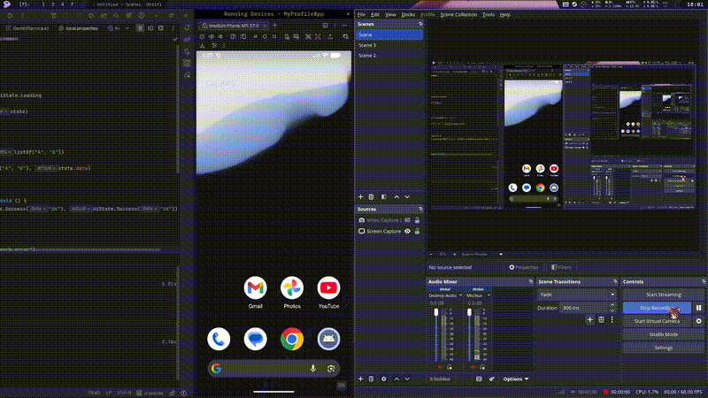

# TUGAS 10 PAM - Testing and Dependency Injection

> this app i made to fullfill my homework/task
-----

## Student Identity

Name = Varasina Farmadani

NIM = 123140107

Class = PAM RA

## Media

### Video
[](media/video/record10.0.mp4)
> click the gif image to see the highres video.

<!-- ## Screenshoot -->
<!---->
<!-- ### Unit Test Result -->
<!--  -->
<!---->
<!-- ### UI Test Result -->
<!--  -->
<!---->
<!-- ### Coverage Report -->
<!--  -->

## Code Documentation

### 1. Koin Dependency Injection Setup

To make the app more modular, testable, and easier to maintain, I improved the Dependency Injection setup using `Koin`. Instead of creating repository, database, settings, network service, and view model instances directly inside the UI layer, all dependencies are registered through Koin modules.

For this week, the DI setup is also split into multiple modules. This makes the dependency graph cleaner than putting everything into one big module.

```kotlin
// di/AppModule.kt
val settingsModule = module {
    single { Settings() }
    single { SettingsManager(settings = get()) }
}

val databaseModule = module {
    single { NotesDatabase(createDatabaseDriver()) }
}

val networkModule = module {
    single { HttpClientFactory.create() }
    single { NewsApi(client = get()) }
    single { GeminiService(client = get()) }
}

val repositoryModule = module {
    single<NoteRepository> { SqlDelightNoteRepository(database = get()) }
    single { NewsRepository(api = get(), settings = get()) }
    single { AiRepository(geminiService = get()) }
}

val platformModule = module {
    single { DeviceInfo() }
    single { NetworkMonitor() }
}

val viewModelModule = module {
    single { ProfileViewModel() }
    single { ThemeViewModel() }
    single { NotesViewModel(repository = get(), settingsManager = get()) }
    single { NewsViewModel(repository = get()) }
    single { AiViewModel(repository = get()) }
}
```

Then all modules are combined into `appModules`, so the root application only needs to load the dependency list once.

```kotlin
val appModules = listOf(
    settingsModule,
    databaseModule,
    networkModule,
    repositoryModule,
    platformModule,
    viewModelModule,
)
```

This fulfills the Dependency Injection requirement because the app now uses constructor injection and interface-based dependency registration. Basically, less tight coupling, easier testing, and less "where did this object even come from?" energy.

### 2. Repository Abstraction for Testability

To make the notes feature easier to test, I refactored the notes data layer into an interface-based repository. The UI and ViewModel depend on `NoteRepository`, while the real implementation is handled by `SqlDelightNoteRepository`.

```kotlin
interface NoteRepository {
    fun getAllNotes(): Flow<List<Note>>
    fun getAllNotesByTitle(): Flow<List<Note>>
    fun searchNotes(query: String): Flow<List<Note>>
    fun getAllNotesOldest(): Flow<List<Note>>
    fun getAllNotesByTitleDesc(): Flow<List<Note>>

    suspend fun getNoteById(id: Int): Note?
    suspend fun insertNote(title: String, content: String)
    suspend fun updateNote(id: Int, title: String, content: String)
    suspend fun toggleFavorite(id: Int, isFavorite: Boolean)
    suspend fun deleteNote(id: Int)
}
```

The real implementation still uses SQLDelight, but tests can now use fake repository or MockK. This makes the business logic testable without depending directly on Android database behavior.

```kotlin
class SqlDelightNoteRepository(
    private val database: NotesDatabase,
) : NoteRepository {
    private val queries = database.noteQueries

    override fun getAllNotes(): Flow<List<Note>> =
        queries
            .selectAll()
            .asFlow()
            .mapToList(Dispatchers.IO)
            .map { it.map { entity -> entity.toDomain() } }
}
```

### 3. Testing Dependencies Setup

For testing, I added dependencies for `kotlin.test`, coroutine test utilities, Turbine, MockK, Koin test, AndroidX Test, Espresso, and Compose UI Test.

```kotlin
commonTest.dependencies {
    implementation(libs.kotlin.test)
    implementation("org.jetbrains.kotlinx:kotlinx-coroutines-test:1.9.0")
    implementation("app.cash.turbine:turbine:1.2.1")
    implementation("io.insert-koin:koin-test:3.5.3")
    implementation("com.russhwolf:multiplatform-settings-test:1.2.0")
}

val androidUnitTest by getting {
    dependencies {
        implementation(libs.kotlin.test)
        implementation("org.jetbrains.kotlinx:kotlinx-coroutines-test:1.9.0")
        implementation("io.mockk:mockk-android:1.13.9")
    }
}

val androidInstrumentedTest by getting {
    dependencies {
        implementation("androidx.test.ext:junit:1.3.0")
        implementation("androidx.test:runner:1.7.0")
        implementation("androidx.test:core:1.7.0")
        implementation("androidx.test.espresso:espresso-core:3.7.0")
        implementation("androidx.compose.ui:ui-test-junit4:1.9.0")
        implementation("org.jetbrains.kotlinx:kotlinx-coroutines-test:1.9.0")
    }
}
```

The coroutine test dependency is kept consistent with the Android test runtime to avoid dependency conflict during `connectedDebugAndroidTest`.

### 4. Unit Test for NoteRepository

I created repository tests to verify the core note behavior. These tests cover insert, update, delete, search, favorite toggle, and sorting behavior.

Example repository test:

```kotlin
@Test
fun `insertNote adds new note`() = runTest {
    val repository = FakeNoteRepository()

    repository.insertNote("New Note", "New Content")

    val notes = repository.snapshot()
    assertEquals(1, notes.size)
    assertEquals("New Note", notes.first().title)
    assertEquals("New Content", notes.first().content)
}
```

Another example for search behavior:

```kotlin
@Test
fun `searchNotes can match content`() = runTest {
    val repository = FakeNoteRepository(
        listOf(testNote(id = 1, title = "Title", content = "Hidden keyword"))
    )

    repository.searchNotes("keyword").test {
        assertEquals("Title", awaitItem().first().title)
        cancelAndIgnoreRemainingEvents()
    }
}
```

This test group verifies the repository business logic without relying on UI interaction.

### 5. NotesViewModel Test with Turbine

The `NotesViewModel` exposes notes as `StateFlow`, so I used Turbine to test Flow emissions. This makes it possible to check whether the ViewModel emits the correct state after search query or sort order changes.

```kotlin
@Test
fun `search query filters notes`() = runTest {
    val repository = FakeNoteRepository(
        listOf(
            testNote(id = 1, title = "Kotlin"),
            testNote(id = 2, title = "Compose"),
        ),
    )
    val viewModel = createViewModel(repository)

    viewModel.notes.test {
        awaitItem()
        awaitItem()

        viewModel.setSearchQuery("Compose")
        advanceUntilIdle()

        val result = awaitItem()
        assertEquals(1, result.size)
        assertEquals("Compose", result.first().title)

        cancelAndIgnoreRemainingEvents()
    }
}
```

This is useful because the notes list is reactive, and a normal assertion is not always enough to test Flow-based state.

### 6. NotesViewModel Test with MockK

I also added MockK tests to verify that the ViewModel calls the repository correctly. This isolates the ViewModel from the real repository and checks the interaction between layers.

```kotlin
@Test
fun `addNote calls repository insertNote`() = runTest {
    coEvery { repository.insertNote(any(), any()) } just Runs

    viewModel.addNote("Title", "Content").join()

    coVerify(exactly = 1) {
        repository.insertNote("Title", "Content")
    }
}
```

The same approach is used for update and delete operations.

```kotlin
@Test
fun `deleteNote calls repository deleteNote`() = runTest {
    coEvery { repository.deleteNote(any()) } just Runs

    viewModel.deleteNote(3).join()

    coVerify(exactly = 1) {
        repository.deleteNote(3)
    }
}
```

This fulfills the MockK testing requirement because the ViewModel is tested using mocked dependencies instead of real database objects.

### 7. Additional Business Logic Tests

To increase business logic coverage, I also added tests for other non-UI classes such as settings, theme state, profile state, AI response DTO, AI repository, news repository, and UI state wrapper.

Examples of tested logic:

- `SettingsManager` default value and persistence.
- Invalid sort order fallback.
- `ThemeViewModel` theme type and mode update.
- `ProfileViewModel` edit mode, online status, and profile update.
- `GeminiResponse.getTextContent()`.
- `GeminiResponse.getErrorMessage()`.
- `AiRepository` prompt action mapping.
- `NewsRepository` cache fallback when API request fails.
- `UiState.Success`, `UiState.Error`, and `UiState.Loading`.

Example:

```kotlin
@Test
fun `invalid sort order falls back to date desc`() {
    val settings = MapSettings()
    settings.putString("sort_order", "BROKEN_SORT")

    val manager = SettingsManager(settings)

    assertEquals(SortOrder.DATE_DESC, manager.sortOrder)
}
```

This makes the test coverage focus more on actual business logic instead of only UI rendering.

### 8. Compose UI Test for Notes Screen

For UI testing, I added Compose UI tests for the Notes screen. The test uses test tags and text assertions to verify whether important UI elements are displayed correctly.

```kotlin
@Test
fun notesList_showsNoteTitleAndContent() {
    composeTestRule.setContent {
        NoteListScreen(
            colors = testColors,
            notesViewModel = notesViewModel,
            onNavigateToDetail = {},
            onNavigateToAdd = {},
        )
    }

    composeTestRule.onNodeWithText("Watchlist (Weekly)").assertIsDisplayed()
}
```

The UI tests cover:

- Empty state when there are no notes.
- Note title and content display.
- Sort button visibility.

This verifies that the Notes screen can render important UI states correctly on Android instrumentation test.

### 9. Coverage Report

Coverage report is generated using the Gradle coverage task.

```shell
./gradlew :composeApp:createCoverageReport
```

The generated report can be opened from:

```shell
composeApp/build/reports/code_coverage_html_report/global/index.html
```

The global coverage report includes the whole app, including generated resources, Compose UI screens, platform-specific implementations, and navigation classes. Because of that, the global percentage can be lower than the business logic coverage. The main testing focus for this task is the business logic layer such as repository, ViewModel, settings, model, AI response handling, and news cache fallback.

### 10. Running the Tests

To run unit tests:

```shell
./gradlew :composeApp:testDebugUnitTest
```

To run UI tests on connected Android device or emulator:

```shell
./gradlew :composeApp:connectedDebugAndroidTest
```

To clean previous test results:

```shell
./gradlew :composeApp:cleanAllTests
```

To generate coverage report:

```shell
./gradlew :composeApp:createCoverageReport
```

-----

This is a Kotlin Multiplatform project targeting Android.

* `/composeApp` is for code that will be shared across your Compose Multiplatform applications.
  It contains several subfolders:
* `commonMain` is for code that’s common for all targets.
* Other folders are for Kotlin code that will be compiled for only the platform indicated in the folder name.
  For example, if you want to use Apple’s CoreCrypto for the iOS part of your Kotlin app,
  the `iosMain` folder would be the right place for such calls.
  Similarly, if you want to edit the Desktop (JVM) specific part, the `jvmMain`
  folder is the appropriate location.

### Build and Run Android Application

To build and run the development version of the Android app, use the run configuration from the run widget
in your IDE’s toolbar or build it directly from the terminal:

* on macOS/Linux

```shell
./gradlew :composeApp:assembleDebug
```

* on Windows

```shell
.\gradlew.bat :composeApp:assembleDebug
```

-----

Learn more about [Kotlin Multiplatform](https://www.jetbrains.com/help/kotlin-multiplatform-dev/get-started.html)…
