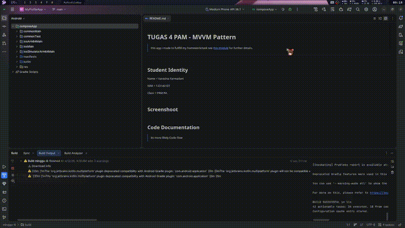
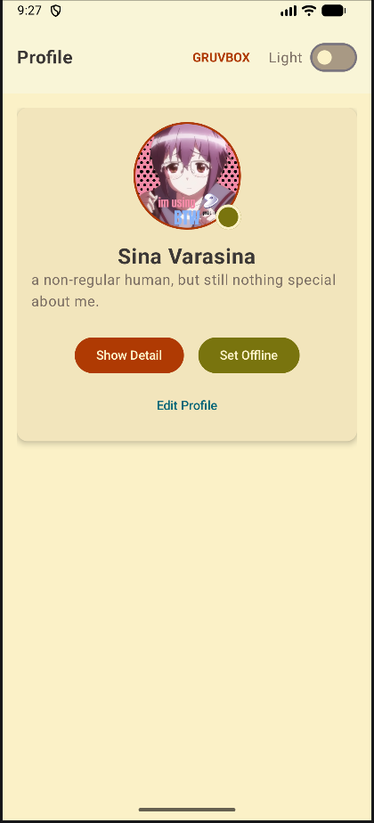

# TUGAS 4 PAM - MVVM Pattern

> this app i made to fullfill my homework/task
> see [this module](https://kuliah2.itera.ac.id/pluginfile.php/63174/mod_resource/content/2/Materi_04_State_Management_MVVM.pdf) for further details.

-----

## Student Identity

Name = Varasina Farmadani

NIM = 123140107

Class = PAM RA

## Media

### Video
[](media/video/record4.0.mp4)
> click the image to see the highres one

## Screenshoot


## Code Documentation

> its more likely Code Flow

### 1\. MVVM Architecture Implementation

Instead of keeping all states locally inside the UI (`App.kt`), I refactored the app to strictly follow the **Model-View-ViewModel (MVVM)** architecture. I created specific Data Classes (`ProfileUiState`) and managed them inside `ProfileViewModel` using `MutableStateFlow`. The UI only acts as a "dumb view" that collects the state and triggers actions.

```kotlin
class ProfileViewModel : ViewModel() {
    private val _uiState = MutableStateFlow(ProfileUiState())
    val uiState: StateFlow<ProfileUiState> = _uiState.asStateFlow()

    fun updateProfile(newName: String, newBio: String, /*...*/) {
        _uiState.update { currentState ->
            currentState.copy(
                name = newName,
                bio = newBio,
                isEditing = false
            )
        }
    }
}
```

### 2\. Dynamic Generic Theming (Global State)

I refactor the custom Catppuccin theme into a robust, generic theming system. I mapped multiple raw color palettes (Catppuccin & GruvBox) into a single generic `Colors` object (`backgroundMain`, `accentPrimary`, etc.).
I also created a separate **Global State** using `ThemeViewModel` to handle Theme Type and Dark/Light Mode switching seamlessly across the app.

```kotlin
// App.kt
val themeViewModel: ThemeViewModel = viewModel()
val themeState by themeViewModel.themeState.collectAsState()

val currentTheme = when (themeState.activeThemeType) {
    ThemeType.CATPPUCCIN -> Themes.Catppuccin
    ThemeType.GRUVBOX -> Themes.GruvBox
}
val colors = if (themeState.themeMode == ThemeMode.DARK) currentTheme.dark else currentTheme.light
```

### 3\. State Hoisting & Stateless Components

To fulfill the state hoisting requirement, I extracted the `TextField` into a reusable, stateless component called `LabeledTextField`. It doesn't hold its own state; instead, it receives the `value` and throws an `onValueChange` callback to its parent. I also did this for `EditProfileCard` and `AppTopBar`.

```kotlin
@Composable
fun LabeledTextField(
    label: String,
    value: String,
    onValueChange: (String) -> Unit, // Callback to parent
    colors: Colors
) {
    Column(modifier = Modifier.fillMaxWidth().padding(vertical = 4.dp)) {
        OutlinedTextField(
            value = value,
            onValueChange = onValueChange,
            // ...
        )
    }
}
```

### 4\. Edit Profile Feature with Local Draft State

I added a feature to edit the profile details. When the user opens the edit form, the app uses `remember` to create "draft" states. This ensures that the global ViewModel state is not bombarded with recompositions on every keystroke, and the data is only sent to the `ViewModel` once the user hits the "Save Changes" button.

```kotlin
var draftName by remember(profileState.name) { mutableStateOf(profileState.name) }
var draftBio by remember(profileState.bio) { mutableStateOf(profileState.bio) }

// Passing draft to EditProfileCard
EditProfileCard(
    draftName = draftName,
    onNameChange = { draftName = it },
    onSaveClick = {
        profileViewModel.updateProfile(draftName, draftBio, /*...*/)
    },
    // ...
)
```

-----

This is a Kotlin Multiplatform project targeting Android.

  * `/composeApp` is for code that will be shared across your Compose Multiplatform applications.
    It contains several subfolders:
  * `commonMain` is for code that’s common for all targets.
  * Other folders are for Kotlin code that will be compiled for only the platform indicated in the folder name.
    For example, if you want to use Apple’s CoreCrypto for the iOS part of your Kotlin app,
    the `iosMain` folder would be the right place for such calls.
    Similarly, if you want to edit the Desktop (JVM) specific part, the `jvmMain`
    folder is the appropriate location.

### Build and Run Android Application

To build and run the development version of the Android app, use the run configuration from the run widget
in your IDE’s toolbar or build it directly from the terminal:

  * on macOS/Linux

```shell
./gradlew :composeApp:assembleDebug

```

  * on Windows

```shell
.\gradlew.bat :composeApp:assembleDebug

```

-----

Learn more about [Kotlin Multiplatform](https://www.jetbrains.com/help/kotlin-multiplatform-dev/get-started.html)…
