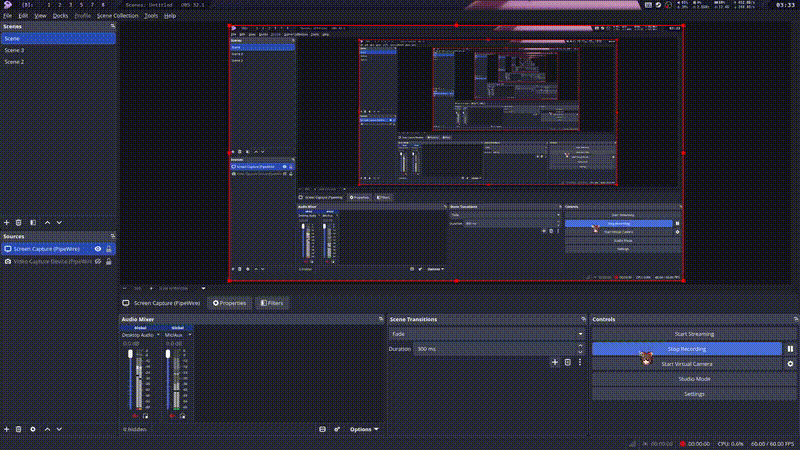

# TUGAS 7 PAM - Local Data Storage

> this app i made to fullfill my homework/task
-----

## Student Identity

Name = Varasina Farmadani

NIM = 123140107

Class = PAM RA

## Media

### Video
[](media/video/record7.0.mp4)
> click the gif image to see the highres video.

## Screenshoot
> maybe later

## Code Documentation

> its more likely Code Flow

### 1\. SQLDelight Database Setup

To store notes locally in a structured and type-safe manner, I implemented `SQLDelight`. I defined the database schema and queries in a `.sq` file and created platform-specific database drivers using the `expect`/`actual` mechanism.

```sql
-- Note.sq
CREATE TABLE NoteEntity (
    id         INTEGER PRIMARY KEY AUTOINCREMENT,
    title      TEXT    NOT NULL,
    content    TEXT    NOT NULL,
    is_favorite INTEGER NOT NULL DEFAULT 0,
    created_at INTEGER NOT NULL,
    updated_at INTEGER NOT NULL
);

selectAll:
SELECT * FROM NoteEntity ORDER BY updated_at DESC;
```

### 2\. CRUD Operations & Repository Pattern

To fulfill the architecture separation requirement, I created a `NoteRepository` that handles all database operations. It maps the generated SQLDelight `NoteEntity` to the domain `Note` model and executes queries safely on the `Dispatchers.IO` thread.

```kotlin
class NoteRepository(
    private val database: NotesDatabase,
) {
    private val queries = database.noteQueries

    suspend fun insertNote(title: String, content: String) {
        val now = System.currentTimeMillis()
        withContext(Dispatchers.IO) {
            queries.insert(title, content, now, now)
        }
    }
    
    // ... update, delete, and toggleFavorite logic ...
}
```

### 3\. Search & Sorting Functionality with Reactive Flows

I implemented a search and sort feature using `StateFlow` in the `NotesViewModel`. By using the `combine` and `flatMapLatest` operators, the UI automatically reacts and queries the local database whenever the user types in the search bar or changes their sorting preference.

```kotlin
val notes: StateFlow<List<Note>> =
    combine(_searchQuery, _sortOrder) { query, sort -> Pair(query, sort) }
        .flatMapLatest { (query, sort) ->
            if (query.isNotBlank()) {
                repository.searchNotes(query)
            } else {
                when (sort) {
                    SortOrder.TITLE_ASC -> repository.getAllNotesByTitle()
                    SortOrder.TITLE_DESC -> repository.getAllNotesByTitleDesc()
                    SortOrder.DATE_DESC -> repository.getAllNotes()
                    SortOrder.DATE_ASC -> repository.getAllNotesOldest()
                }
            }
        }.stateIn(viewModelScope, SharingStarted.WhileSubscribed(5000), emptyList())
```

### 4\. Settings Management with DataStore

For persisting user preferences like themes (Catppuccin, GruvBox, Light/Dark) and list sort orders, I used `multiplatform-settings` (a KMP alternative to Android DataStore). The `SettingsManager` acts as a key-value storage wrapper, cleanly saving and retrieving settings.

```kotlin
class SettingsManager(
    private val settings: Settings,
) {
    var sortOrder: SortOrder
        get() =
            try {
                SortOrder.valueOf(
                    settings.getString("sort_order", SortOrder.DATE_DESC.name),
                )
            } catch (e: Exception) {
                SortOrder.DATE_DESC
            }
        set(value) {
            settings.putString("sort_order", value.name)
        }
}
```

### 5\. Offline-First Architecture

By migrating the Notes app from hardcoded dummy data to a local SQLDelight database, the application now fully embraces an **Offline-First Architecture**. All data creation, reading, updating, and deletion (CRUD) happens directly on the device's local storage. This guarantees that the core features remain perfectly reliable, responsive, and available to the user even without an internet connection.

-----

This is a Kotlin Multiplatform project targeting Android.

  * `/composeApp` is for code that will be shared across your Compose Multiplatform applications.
    It contains several subfolders:
  * `commonMain` is for code that’s common for all targets.
  * Other folders are for Kotlin code that will be compiled for only the platform indicated in the folder name.
    For example, if you want to use Apple’s CoreCrypto for the iOS part of your Kotlin app,
    the `iosMain` folder would be the right place for such calls.
    Similarly, if you want to edit the Desktop (JVM) specific part, the `jvmMain`
    folder is the appropriate location.

### Build and Run Android Application

To build and run the development version of the Android app, use the run configuration from the run widget
in your IDE’s toolbar or build it directly from the terminal:

  * on macOS/Linux

```shell
./gradlew :composeApp:assembleDebug

```

  * on Windows

```shell
.\gradlew.bat :composeApp:assembleDebug

```

-----

Learn more about [Kotlin Multiplatform](https://www.jetbrains.com/help/kotlin-multiplatform-dev/get-started.html)…
