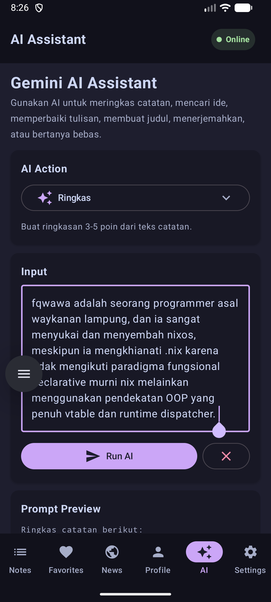
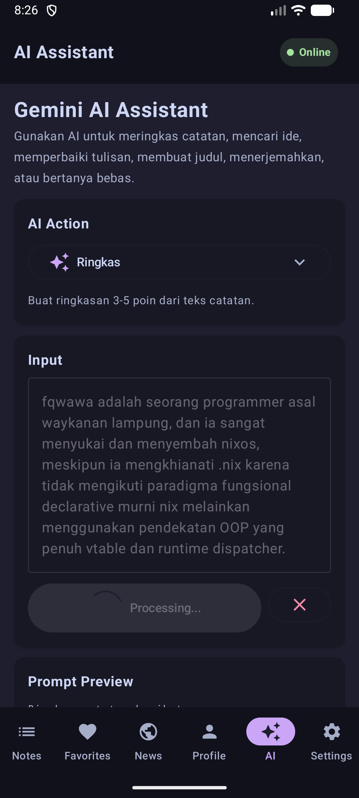
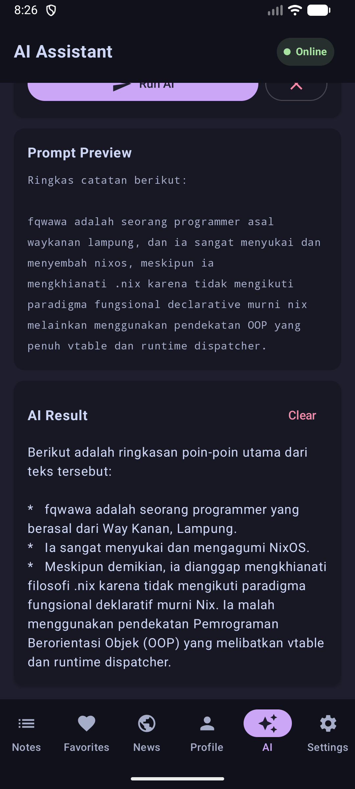

# TUGAS 9 PAM - Integrasi AI API

> this app i made to fullfill my homework/task
-----

## Student Identity

Name = Varasina Farmadani

NIM = 123140107

Class = PAM RA

## Media

## Screenshoot
### Input

### Request

### Response


## Code Documentation

### 1\. Gemini API Key Configuration

For this task, I integrated Gemini API into the Kotlin Multiplatform app. The API key is not hardcoded inside the source code. Instead, it is stored in `local.properties`, then injected into Android `BuildConfig` during build time.

```properties
# local.properties
# DO NOT COMMIT THIS FILE
GEMINI_API_KEY=your_gemini_api_key_here
```

```kotlin
// composeApp/build.gradle.kts
val localProps = rootProject.file("local.properties")
val properties = Properties()

if (localProps.exists()) {
    localProps.inputStream().use { properties.load(it) }
}

buildConfigField(
    "String",
    "GEMINI_API_KEY",
    "\"${properties.getProperty("GEMINI_API_KEY", "")}\"",
)
```

To keep the shared code clean, I used the `expect`/`actual` pattern. The common code only knows about `ApiConfig`, while Android provides the actual value from `BuildConfig`.

```kotlin
// commonMain
expect object ApiConfig {
    val geminiApiKey: String
}

// androidMain
actual object ApiConfig {
    actual val geminiApiKey: String = BuildConfig.GEMINI_API_KEY
}
```

### 2\. Gemini DTO and Ktor Service

The Gemini request and response models are represented using `kotlinx.serialization`. The service sends a `POST` request to the Gemini API using the existing Ktor client.

```kotlin
@Serializable
data class GeminiRequest(
    val contents: List<GeminiContent>,
    val generationConfig: GenerationConfig? = null,
)

@Serializable
data class GeminiContent(
    val parts: List<GeminiPart>,
    val role: String = "user",
)

@Serializable
data class GeminiPart(
    val text: String,
)
```

```kotlin
class GeminiService(
    private val client: HttpClient,
) {
    private companion object {
        const val BASE_URL = "https://generativelanguage.googleapis.com/v1beta"
        const val MODEL = "gemini-2.5-flash"
    }

    suspend fun generateContent(
        prompt: String,
        systemPrompt: String? = null,
    ): Result<String> =
        runCatching {
            val request =
                GeminiRequest(
                    contents = buildContents(prompt, systemPrompt),
                    generationConfig =
                        GenerationConfig(
                            temperature = 0.7,
                            maxOutputTokens = 1000,
                        ),
                )

            val response: GeminiResponse =
                client.post("$BASE_URL/models/$MODEL:generateContent") {
                    contentType(ContentType.Application.Json)
                    parameter("key", ApiConfig.geminiApiKey)
                    setBody(request)
                }.body()

            response.getTextContent() ?: error("Respons kosong dari AI")
        }
}
```

### 3\. Prompt Engineering with System Prompts

The AI feature uses structured system prompts so the response format is more predictable. Each action has a specific role, task, and constraint. This makes the output more consistent than sending a raw user input directly to the model.

```kotlin
object SystemPrompts {
    val SUMMARIZER = """
        Kamu adalah asisten yang ahli dalam merangkum teks.
        Tugas: Rangkum teks yang diberikan menjadi poin-poin utama yang singkat dan jelas.

        Rules:
        - Gunakan Bahasa Indonesia
        - Maksimal 3-5 poin utama
        - Setiap poin maksimal 1-2 kalimat
        - Fokus pada informasi paling penting
        - Jangan menambahkan informasi yang tidak ada di teks asli
    """.trimIndent()

    val WRITING_IMPROVER = """
        Kamu adalah editor profesional yang membantu memperbaiki tulisan.
        Tugas: Perbaiki tulisan yang diberikan tanpa mengubah makna aslinya.

        Rules:
        - Gunakan Bahasa Indonesia yang baik dan benar
        - Perbaiki grammar, ejaan, dan struktur kalimat
        - Pertahankan gaya dan tone asli penulis
        - Jangan menambahkan informasi baru
    """.trimIndent()
}
```

The implemented AI actions are:

- Summarize text
- Generate ideas
- Improve writing
- Suggest title
- Translate to English
- Free chat / ask AI

### 4\. AI Repository Pattern

To keep the app architecture clean, AI access is wrapped inside `AiRepository`. The UI and ViewModel do not communicate directly with the Gemini API service. They only call repository functions.

```kotlin
class AiRepository(
    private val geminiService: GeminiService,
) {
    suspend fun summarize(text: String): Result<String> =
        geminiService.generateContent(
            prompt = text,
            systemPrompt = SystemPrompts.SUMMARIZER,
        )

    suspend fun improveWriting(text: String): Result<String> =
        geminiService.generateContent(
            prompt = text,
            systemPrompt = SystemPrompts.WRITING_IMPROVER,
        )

    suspend fun generateIdeas(topic: String): Result<String> =
        geminiService.generateContent(
            prompt = topic,
            systemPrompt = SystemPrompts.IDEA_GENERATOR,
        )
}
```

This keeps the code modular and easier to maintain. If the AI provider needs to be changed later, only the repository/service layer needs to be adjusted.

### 5\. AI ViewModel and UI State

The AI screen is controlled using a ViewModel with `StateFlow`. The ViewModel stores the current input, selected action, loading state, result, and error message.

```kotlin
data class AiUiState(
    val inputText: String = "",
    val selectedAction: AiAction = AiAction.SUMMARIZE,
    val isLoading: Boolean = false,
    val result: String? = null,
    val errorMessage: String? = null,
)
```

```kotlin
fun execute() {
    val input = _uiState.value.inputText.trim()

    if (input.isBlank()) {
        _uiState.update {
            it.copy(errorMessage = "Input tidak boleh kosong.")
        }
        return
    }

    viewModelScope.launch {
        _uiState.update {
            it.copy(isLoading = true, result = null, errorMessage = null)
        }

        repository.executeAction(
            action = _uiState.value.selectedAction,
            input = input,
        ).onSuccess { result ->
            _uiState.update {
                it.copy(isLoading = false, result = result)
            }
        }.onFailure { error ->
            _uiState.update {
                it.copy(
                    isLoading = false,
                    errorMessage = error.message ?: "Gagal mendapatkan respons AI.",
                )
            }
        }
    }
}
```

### 6\. AI Assistant Screen

I added a new `AI Assistant` screen to the app. The screen contains an action selector, a text input field, a `Run AI` button, loading feedback, error feedback, and result output.

```kotlin
@Composable
fun AiAssistantScreen(
    viewModel: AiViewModel,
    colors: Colors,
) {
    val uiState by viewModel.uiState.collectAsState()

    Column(
        modifier =
            Modifier
                .fillMaxSize()
                .padding(16.dp),
        verticalArrangement = Arrangement.spacedBy(12.dp),
    ) {
        AiActionSelector(
            selectedAction = uiState.selectedAction,
            onActionSelected = viewModel::setAction,
            colors = colors,
        )

        OutlinedTextField(
            value = uiState.inputText,
            onValueChange = viewModel::setInputText,
            label = { Text("Input Text") },
            modifier = Modifier.fillMaxWidth(),
        )

        Button(
            onClick = viewModel::execute,
            enabled = !uiState.isLoading,
            modifier = Modifier.fillMaxWidth(),
        ) {
            Text(if (uiState.isLoading) "Processing..." else "Run AI")
        }

        uiState.errorMessage?.let {
            Text(text = it, color = colors.error)
        }

        uiState.result?.let {
            AiResultCard(result = it, colors = colors)
        }
    }
}
```

### 7\. Navigation and Dependency Injection

The AI feature is integrated into the existing app navigation and dependency injection setup. A new bottom navigation item was added, so the user can open the AI Assistant directly from the main app.

```kotlin
sealed class BottomNavItem(
    val route: Any,
    val icon: ImageVector,
    val title: String,
) {
    object Ai : BottomNavItem(Screen.AiAssistant, Icons.Default.SmartToy, "AI")
}
```

```kotlin
sealed interface Screen {
    @Serializable data object AiAssistant : Screen
}
```

```kotlin
val appModule =
    module {
        single { GeminiService(client = get()) }
        single { AiRepository(geminiService = get()) }
        single { AiViewModel(repository = get()) }

        // other dependencies...
    }
```

### 8\. Error Handling

The AI feature includes basic error handling for common failure cases:

- Empty input
- Missing Gemini API key
- Empty AI response
- Network/API failure
- Loading state while waiting for the model response

```kotlin
if (ApiConfig.geminiApiKey.isBlank()) {
    return Result.failure(
        IllegalStateException(
            "Gemini API key is not configured. Add GEMINI_API_KEY to local.properties.",
        ),
    )
}
```

This makes the feature safer to demo because the UI will show feedback instead of silently failing.

-----

This is a Kotlin Multiplatform project targeting Android.

  * `/composeApp` is for code that will be shared across your Compose Multiplatform applications.
    It contains several subfolders:
  * `commonMain` is for code that’s common for all targets.
  * Other folders are for Kotlin code that will be compiled for only the platform indicated in the folder name.
    For example, if you want to use Apple’s CoreCrypto for the iOS part of your Kotlin app,
    the `iosMain` folder would be the right place for such calls.
    Similarly, if you want to edit the Desktop (JVM) specific part, the `jvmMain`
    folder is the appropriate location.

### Build and Run Android Application

Before building the app, add your Gemini API key to `local.properties` inside the `minggu-9` project directory:

```properties
GEMINI_API_KEY=your_gemini_api_key_here
```

To build and run the development version of the Android app, use the run configuration from the run widget
in your IDE’s toolbar or build it directly from the terminal:

  * on macOS/Linux

```shell
./gradlew :composeApp:assembleDebug
```

  * on Windows

```shell
.\gradlew.bat :composeApp:assembleDebug
```

-----

Learn more about [Kotlin Multiplatform](https://www.jetbrains.com/help/kotlin-multiplatform-dev/get-started.html)…
